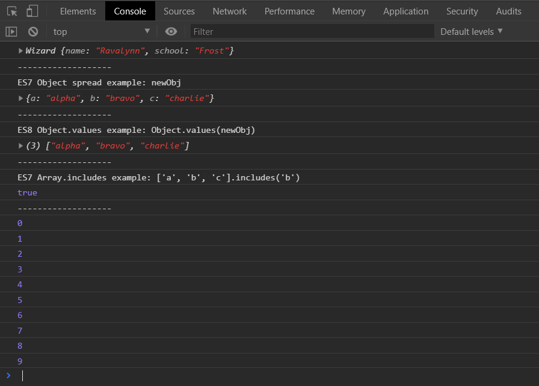
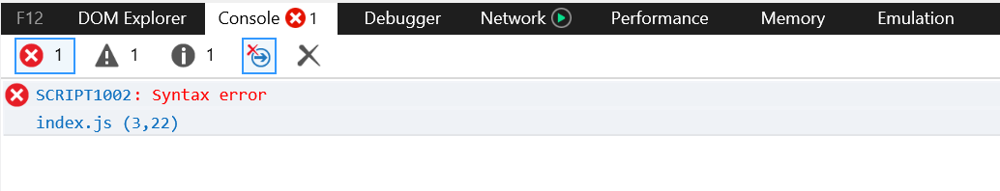
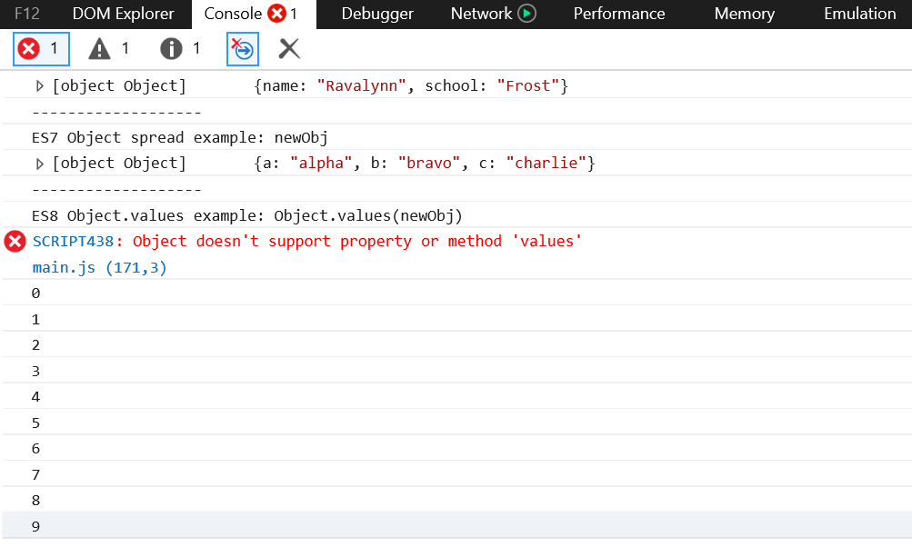
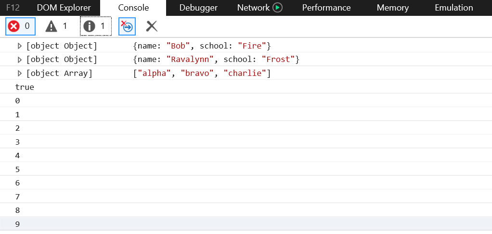

In this article I want to demonstrate how to reduce the file size of transpiled JavaScript from Babel that I feel could be explained better than what I commonly find through searches and documentation lookups.

We'll also be taking a peak under the hood of what happens for some ES2015+ transpiled syntax to demystify a few things. Just knowing a little bit of what is going on in the tools I use helps alleviate some of the anxiety I have about things that are "just magic" to me, and often gives me additional places to look during troubleshooting.

### The setup

The source for the starting point of this article can be found [here](https://github.com/Jimmydalecleveland/webpack4-setups/tree/esnext). This repository is a collection of minimal Webpack setups, each on their own branch, that I use as a reference for myself and explaining to others.

_Note: Normally you wouldn't push up your `dist` or distribution/public folder, but sometimes I want to be able to reference the output without cloning down and building._

### Let's get into it

To begin with, we have a simple setup using Webpack and Babel to bundle and transpile a couple small files that use syntax and methods from a few different ES versions after ES5. This is commonly referred to as ES2015+, ES6+, or ESNext. ESNext makes the mose sense to me, so that's what I'm running with. You can reference the repo I linked above for the config files if you like, but I'm only going to show snippets of the pertinent code.

From this point on I'll be referring to the original, pre-transpiled, code by the directory and filename: `src/index.js`. The transpiled output will be `dist/main.js`.

This is the file we wish to transpile. It has some examples of newer syntax, such as `import`, arrow functions, `let` and `const`, and the spread operator on an Object, as well as a few methods: `Object.values` and `Array.includes`. We'll get into the reason why I make those distinctions, syntax and methods, a little later. We'll also get into the reason for the `for` loop.

```js
import Wizard from './Wizard'

const Ravalynn = new Wizard('Ravalynn', 'Frost')
console.log(Ravalynn)
console.log('-------------------')

const component = () => {
  let element = document.createElement('div')
  const obj = { a: 'alpha', b: 'bravo' }

  // ES7 Object spread test
  const newObj = { ...obj, c: 'charlie' }
  console.log('ES7 Object spread example: newObj')
  console.log(newObj)

  // ES8 Object.values test
  // Will not transpile without babel polyfills because it is a new method
  console.log('-------------------')
  console.log('ES8 Object.values example: Object.values(newObj)')
  console.log(Object.values(newObj))
  console.log('-------------------')
  // ES Array.includes test
  console.log("ES7 Array.includes example: ['a', 'b', 'c'].includes('b')")
  console.log(['a', 'b', 'c'].includes('b'))
  console.log('-------------------')

  return element
}

// Event queue block scoping test
for (let i = 0; i < 10; i++) {
  setTimeout(function() {
    console.log(i)
  }, 1)
}

document.body.appendChild(component())
```

After running this code through Babel, we can open it up in a browser and check out the console tab of devtools to see the output.


Everything runs as expected, with no errors. For people brand new to this world, this is where they might stop. But if you change the `index.html` to load the `src/index.js`, rather than the Babelified code, and remove the `import` statement and the associated invocation and log, you would see that the rest of the code works fine.

In this example I'm using Chrome 72, which supports all the previous code (`import` is a special case). If we were to load this up in IE11, however, we'd see this:



It's failing on line 3 when it encounters the `=>` symbol. If you take a look at [caniuse](https://caniuse.com/#feat=arrow-functions) for ES6 arrow functions, you'll see that IE11 does not support it, so that makes sense.

Let's go back to the original setup, and see what happens in IE11.


It almost looks like we are back in business, with our `import`, arrow functions, Object spread, `let` and `const` all working... until we hit a snag on the `Object.values` part of our code.

You can see that IE11 does not know what the `Object.values` method is, as it throws this error when encountering it: `Object doesn't support property or method 'values'`. This is the point where many become frustrated with Babel, saying something to the tune of "I thought preset-env was supposed to include everything from ES2015 on". I think it's a fair assumption, but I have a bias since I've been there myself. The thing about `present-env` is that it includes all ESNext "syntax" but not all the methods that have been added since ES5.

### Let's dive a little deeper

To explain this more clearly, we are going to look at some of the output from Babel. Let's do a before and after of our `Object.values` problem child. Here's the original.

```js
// ES8 Object.values test
// Will not transpile without babel polyfills because it is a new method
console.log(Object.values(newObj))
```

And here is the relevant line in our `dist/main.js`.

```js
console.log(Object.values(newObj))
```

It's the same as the original line, because it is a new method and that requires a "polyfill", or backwards compatible replacement, in order to make it function correctly. `preset-env` is only for new syntax, and does not include polyfills for entirely new methods.

If we take a look at some code that outputs properly, we'll see that some actual work is being done by Babel.

```js
// src/index.js

const obj = { a: 'alpha', b: 'bravo' }

// ES7 Object spread test
const newObj = { ...obj, c: 'charlie' }
```

```js
// dist/main.js

var obj = {
  a: 'alpha',
  b: 'bravo',
} // ES7 Object spread test

var newObj = _objectSpread({}, obj, {
  c: 'charlie',
})
```

You'll notice that the transpiled code has taken the spread syntax and replaced it with a `_objectSpread` function. If we look further up in this same file, we'll find:

```js
function _objectSpread(target) {
  for (var i = 1; i < arguments.length; i++) {
    var source = arguments[i] != null ? arguments[i] : {}
    var ownKeys = Object.keys(source)
    if (typeof Object.getOwnPropertySymbols === 'function') {
      ownKeys = ownKeys.concat(
        Object.getOwnPropertySymbols(source).filter(function(sym) {
          return Object.getOwnPropertyDescriptor(source, sym).enumerable
        })
      )
    }
    ownKeys.forEach(function(key) {
      _defineProperty(target, key, source[key])
    })
  }
  return target
}
```



### Why not just include the polyfills by default?

Sometimes this question comes up when someone's code is failing on older browsers and they expected `preset-env` to include everything ES2015+. The simple answer is that that would create a **much** larger file. The unminified version of our `main.js` is 196 lines, and the unminified size is 2.55KiB. The unminified using polyfills is over 9000 (9815 in this case). That's 83.9 KiB minified.

That is obviously a TON of code for our end user to download. Any developers not wanting to support every browser under the sun would not want to be forced into this situation.

If you are using Webpack, you can add all polyfills by installing the `@babel/polyfill` package and updating your entry point in your `webpack.config.js` like so:

```js
// webpack.config.js
module.exports = {
  entry: ['@babel/polyfill', './src/index.js']
  // ...
```

Babel recommends you select each polyfill you need, rather than adding every polyfill that exists like the above example, and now you know why.

### Why not only add polyfills for methods my code _actually_ uses?

In the `.babelrc` file, you can add the `useBuiltIns` option with the `usage` value to only add polyfills which your codebase uses. This is flagged as `experimental` in the Babel docs (as of March 2019). If you do this, do not add `@babel/polyfill` in your webpack entry point. You still need to have `@babel/polyfill` installed, but you shouldn't require it anywhere in your codebase. Here's an example of the `.babelrc`

```js
// .babelrc
{
  "presets": [["@babel/preset-env", { "useBuiltIns": "usage" }]]
}
```

The result of this build gives us a much smaller filesize for the `main.js`: 1512 lines unminified and 12.3 KiB minified.

```json
{
  "presets": [
    [
      "@babel/preset-env",
      {
        "debug": true,
        "useBuiltIns": "entry",
        "targets": { "chrome": "58", "ie": "11" }
      }
    ]
  ]
}
```

```bash
Replaced `@babel/polyfill` with the following polyfills:
```

```bash
[root\src\index.js] Added following polyfills:
  es7.object.values { "ie":"11" }
  es6.array.iterator { "ie":"11" }
  web.dom.iterable { "chrome":"58", "ie":"11" }
  es6.string.includes { "ie":"11" }
  es7.array.includes { "ie":"11" }
  es6.object.keys { "ie":"11" }
```

using 'targets' in babelrc seems to override the browserslist
?? useBuiltIns: entry seems to be for setups without a bundler like webpack, since there is no entry point to pipe it in, you need to put it in the entry file. This makes this setting pointless with webpack.
