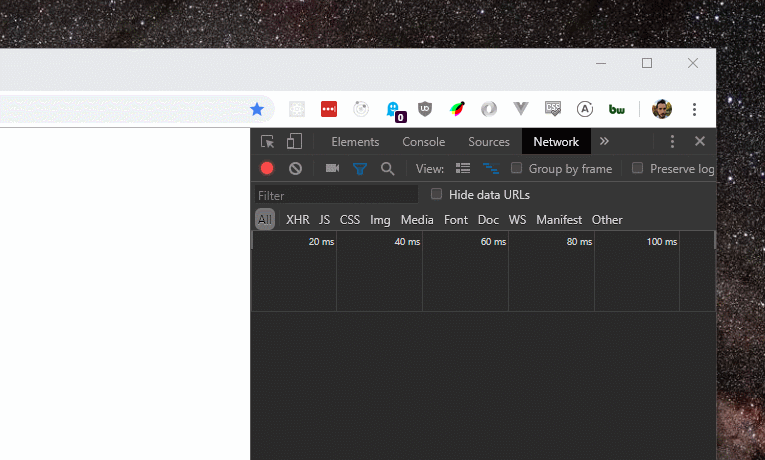
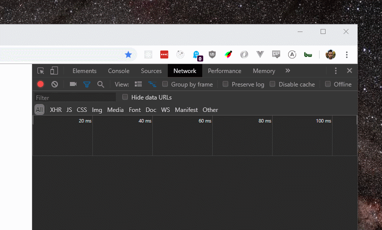
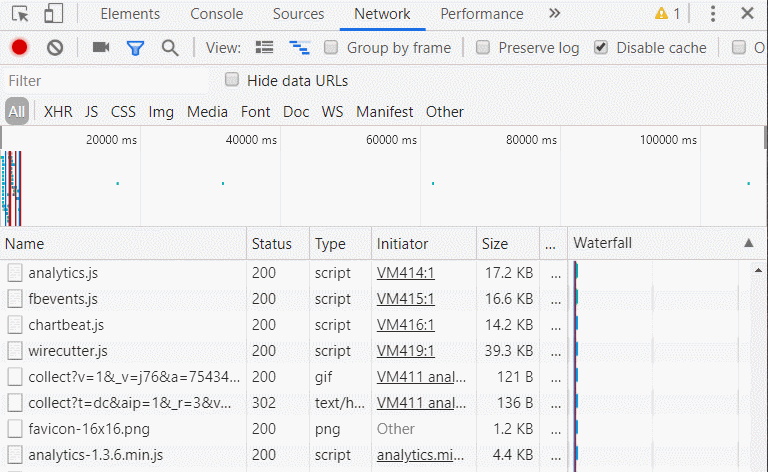

TL;DR: With Chrome DevTools open, pressing `Control+Shift+p` or `Command+Shift+p` on Mac will open the Command Menu/Palette. This gives you a nice quick-search menu for finding functionality that you'd otherwise have to click around in the GUI to find. Read more about it [here](https://developers.google.com/web/tools/chrome-devtools/command-menu/)

Let's say you wanted to disable cache in DevTools while testing out a site you are working on. Maybe that little checkbox is hidden because your inspector window is too small, maybe some Chrome update has changed where it is, or maybe you just temporarily spaced it and are in the middle of a presentation and don't want to fumble around.

### There's got to be a better way!

Rather than searching around, you can actually use the Command Menu/Palette shortcut (`Control+Shift+p` or `Command+Shift+p` on Mac) and type in "cache". It uses fuzzy search so you can just guess at what you are trying find with random words (as long as they are in order) and Chrome will figure it out, unlike Windows search which was designed to not find what you want. Simply hit enter on the command you want to run and it will check that box for you. Super cool of the Chrome team to add this functionality in, I find myself using it often just to save time as well.

### But wait! There's more!
You can also use the command menu to look through tons of fun and useful functionalities that Chrome has that would be a lot more cumbersome to look for by clicking around through the DevTools GUI. This is how I found the "show third party badges" option for the network tab, which is a nice quality of life feature for me.

It can also just be faster. When I want to take a full page screenshot I just press the shortcut and begin typing "fullscreen" and hit enter. Toggling Javascript, pausing on exceptions, and paint flashing, are all really quick from the command menu. That's all I've got for this one, you can leave now.