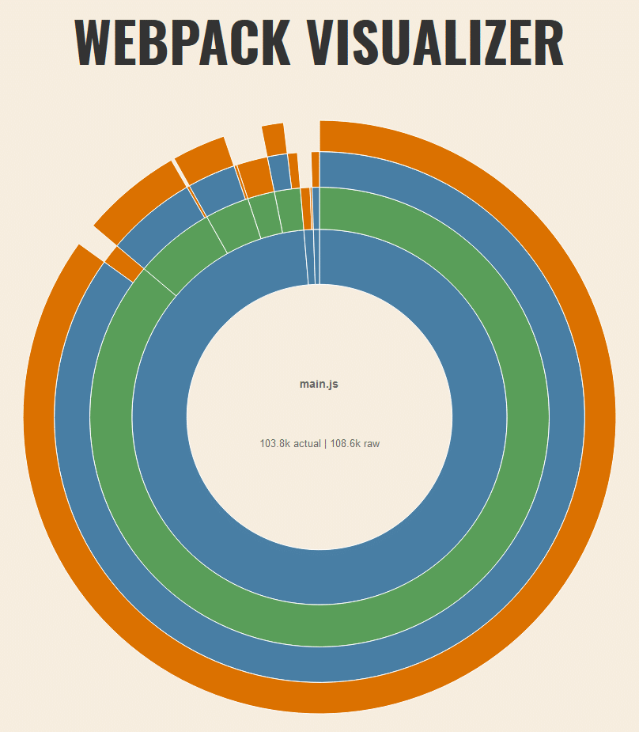
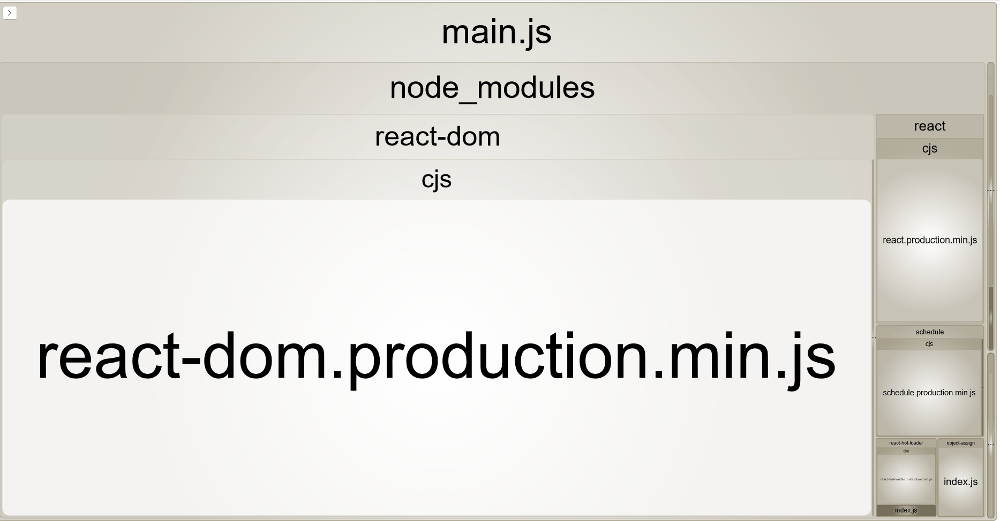
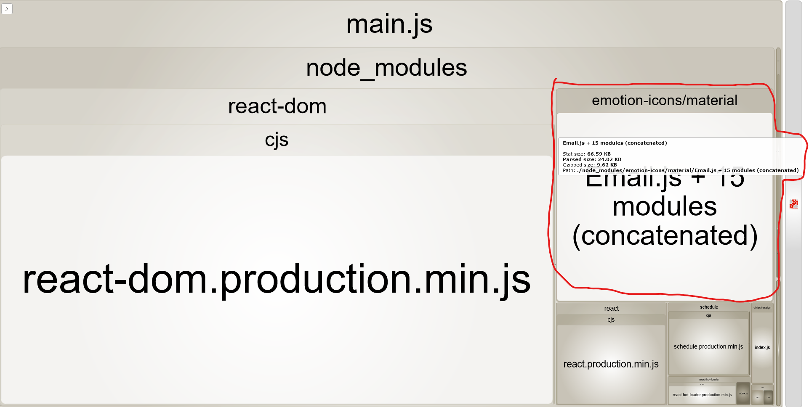
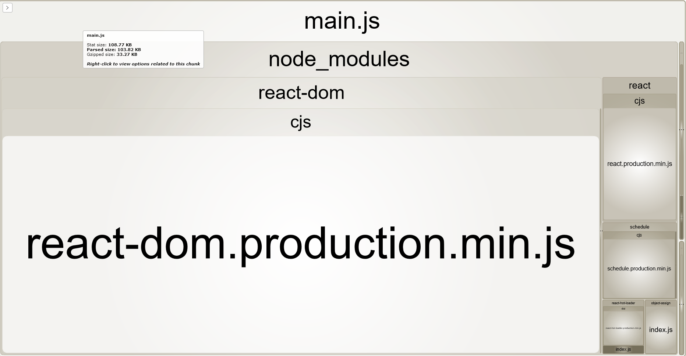
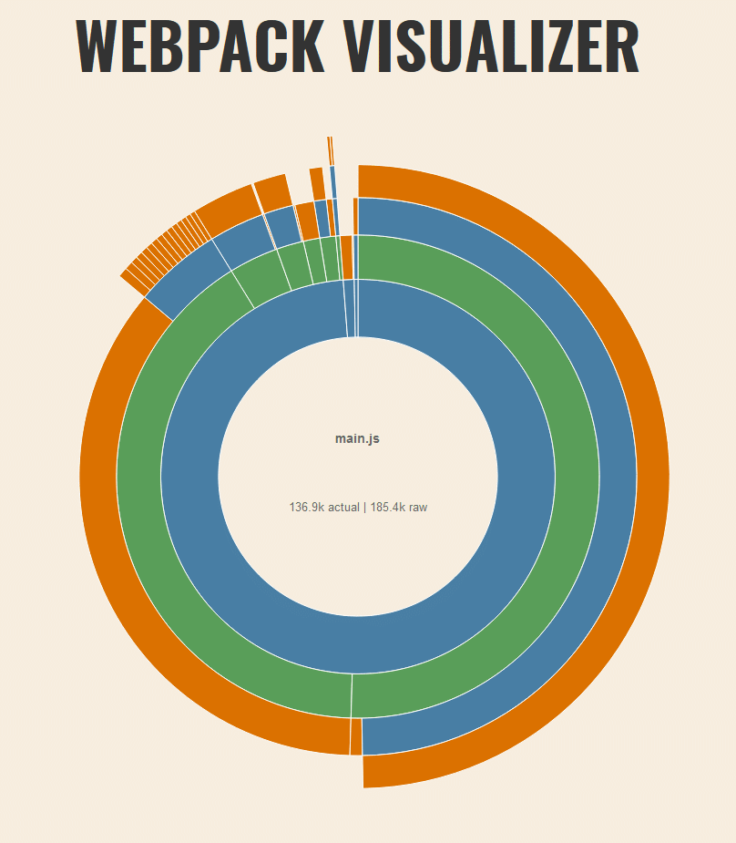
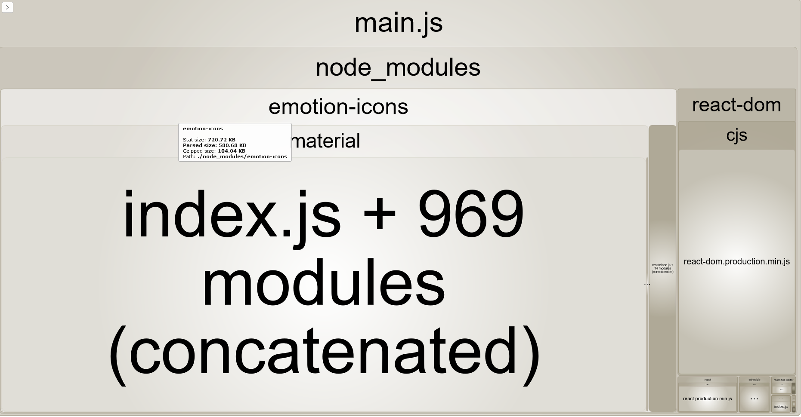

> Flavor text: Arcane Mysteries is a series where I attempt to dig deeper into the mysteries of the coding cosmere.

We should all be looking out for our users when it comes to JavaScript bundle size, as page load speed is a critical component of good UX. A bundle visualizer can be a very handy tool for tracking down packages, or even your own code, for large file size offenders. I'm going to talk about two visualizers, and a little journey I went on today to explore exactly when Webpack adds a package to the bundle.

I'm using a [repo for starting new projects](https://github.com/Jimmydalecleveland/webpack4-setups/tree/react) that I created awhile back as the codebase for this experiment. Not necessary to look at, but in case you want a reference point for your own testing. I'm using the `react` branch because we'll be analyzing a React bundle.

### Webpack Visualizer
This is a browser app that lets you drop in a json file of your webpack build and turns it into an interactive chart. Here's what my starting bundle looks like through the tool.



To get started, you'll need to run a webpack command in your terminal of choice.
```bash
webpack --json > stats.json
```

Which I've made into a script in my `package.json` file so I can re-run it a bunch and not install webpack globally.
```json
// package.json
"scripts": {
  // other scripts ...
  // highlight-next-line
  "stats": "webpack --json > stats.json"
}
```
*Note: Webpack's docs have a section on [the previous command](https://webpack.js.org/api/cli/#common-options).*

Then you just go to [the Webpack Visualizer website](https://chrisbateman.github.io/webpack-visualizer/), drop your file in the handy labeled box, and your visualization is ready.

The default name and size shown center circle is your whole bundle if you have a single output file, in my case that's `main.js`. You can see that `main.js` is 103.8k in actual size (non-gzipped). I wondered what exactly the rest of these colored circles represented when I first encounted it so I'll give a quick description before moving on.

### Webpack Visualizer Breakdown
You can see that when I hover the innermost blue band, "node\_modules" shows up in the center, and a thin sliver in the north becomes a lower opacity. This is to represent that `node_modules` is part of the `main.js` file, and includes all the non transparent bands within it. This is the same gif as the previous one, just placed here for easier reference while I discuss it.


As I move out to the next band, a green one with the title "react-dom", the "node\_modules" band and a few slices in the northwest become transparent. This tells us that "react-dom" is a very large dependency in our bundle. So far we've determined that `node_modules` is the vast majority of our bundle (98.7%), and that the `react-dom` package is vast majority of size in our `node_modules`.

When I highlight a green slice in the northwest, it shows "react". We can see from this, if we didn't already know, that the `react` package is quite small in comparison to the `react-dom` package that accompanies it for web. Everything else becomes transparent when hovering over it to show that it's isolated from everything at the same depth and outward. 

Summed up, whatever you are hovering keeps everything that is a decendant of itself colored in full, and makes transparent anything that it decends from, or anything that is separate from it.

Finally, you can see the "src" chunk in the northern area is quite small (0.8%), and that's my actual code (in the `src` directory of my project). This is a minimal example of webpack and React so that is what we'd expect. Pretty nice tool, eh?

### An Alternative to Webpack Visualizer
A nice alternative tool is the package [`webpack-bundle-analyzer`](https://www.npmjs.com/package/webpack-bundle-analyzer) package. The UI can be a little wonkey but it gives you some cool features *and* you can run the exact same script, without dropping the `.json` output file in a browser every time you build. It actually auto-opens a new browser window with a localhost page. Here's an example of what it looks like for the same `main.js` bundle we've seen so far.



The zooming in by clicking/scrolling of this tool had unintuitive behavior to me, but I like the general visualization of boxes. It reminds me of a lovely little tool called [windirstat](https://windirstat.net/) for Windows that helps visualize disk space usage.

To install it, you can add it as a devDependency:
```bash
yarn add -D webpack-bundle-analyzer
```

Then you'll need to add the import and config property to your `webpack.config.js` file:

```js
// webpack.config.js
const path = require("path");
/* highlight-start */
const BundleAnalyzerPlugin = require("webpack-bundle-analyzer")
  .BundleAnalyzerPlugin;
/* highlight-end */


module.exports = {
  // mode defaults to 'production' if not set

  entry: "./src/index.jsx",
  output: {
    filename: "main.js",
    path: path.resolve(__dirname, "dist")
  },

  // other webpack properties
  // ...

  /* highlight-next-line */
  plugins: [new BundleAnalyzerPlugin()]
};
```

You can run the same script as before (`yarn stats` for me) to start up the local server.

### Expermimenting with imports
To dig in deeper, I installed `emotion-icons` which requires `@emotion/core` and `@emotion/styled` to work. I'm using `emotion` as the CSS-in-JS solution for my current project, so this package is a logical fit for my case.

Without importing or using any of the packages I've added, I ran the visualizer and got the same results. So even though we've installed 3 packages, they were not bundled into my `main.js`.

That's what I expected, but I was curious if I imported them, but didn't use them, if Webpack would figure that out without any special settings. Here's what my `App.jsx` file looked like.

```jsx
import React from "react";
import { hot } from "react-hot-loader";
import { Email } from "emotion-icons/material";

const App = () => (
  <div>
    Nothing to see here.
  </div>
);

export default hot(module)(App);
```

I'm importing the Email icon but not using it anywhere. The bundle size was the same as if I hadn't installed any of the packages. That's pretty cool.

Ok, finally, let's actually use the icon.
```jsx
import React from "react";
import { hot } from "react-hot-loader";
import { Email } from "emotion-icons/material";

const App = () => (
  <div>
  {/* highlight-next-line */}
    <Email />
  </div>
);

export default hot(module)(App);
```

And what does the great visualizer tell us now? (hover text is difficult to read, you can click the image for a bigger size)



Well! Look who showed up to the party. It seems loading that icon has added 24.02 KB to our bundle (9.62 KB Gzipped). But what's with the "+ 15 modules (concatenated)?

I haven't figured it out. It isn't the other icons in the package cuz there are a lot more than 15. And as you'll see in a moment, when we pull in more icons we get a different message.




with the 15 icons and their dependencies, the bundle is now 136.9k actual



I also tried this alternate import style to see if could possible effect the size at all. The result was the same as the destructured version.
```js
import Email from "emotion-icons/material/Email";

const App = () => (
  <div>
    <Email />
  </div>
);
```

[Emotion Material](https://rosenstein.io/emotion-icons/icons-material-index)